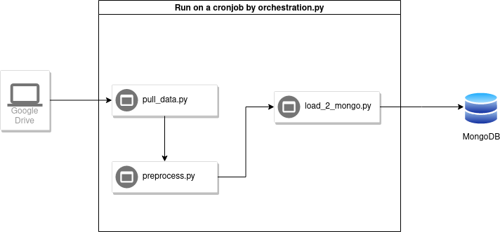

This repo holds a data processing workflow that pulls data from a google drive folder and then converts the zst file into a JSONL file. Afterwards, that jsonL file is unnested, breaking characters are removed, and checked against a schema (optional). When that data is processed it is then uploaded to a mongoDB collection.

The orchestration.py file currently checks if files have been created in each step of the pipeline using the cadence variable in the config.yaml. 
Run the Makefile after cloning the repo to install all the necessary dependencies.

